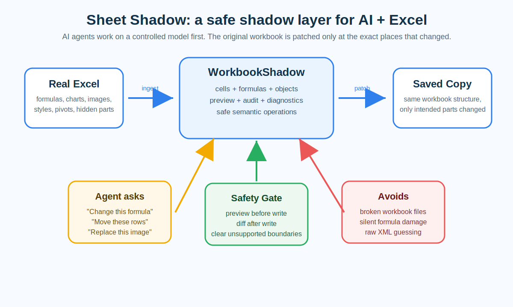

# Sheet Shadow - Safe Excel Editing for AI Agents

**Author: Ziyang Xu**

**A public, open-source MCP project for making AI agents safer around real Excel files.**
**一个面向 AI Agent 的开源 MCP 项目：让 Agent 修改真实 Excel 文件时更安全、更可控。**

Sheet Shadow lets an AI agent work on a shadow model of an Excel workbook first, preview the impact, and then patch only the exact parts that should change.
Sheet Shadow 先让 AI Agent 在 Excel 的“影子模型”上思考和修改，确认影响范围后，只把真正需要改变的部分写回新的工作簿副本。



---

## Story / 项目故事

When I started building with AI agents, I hit a surprisingly painful wall:

**AI is getting very good at writing code, but it is still dangerously clumsy with real Excel workbooks.**

Excel is not just a grid of cells. A serious workbook may contain formulas, styles, merged cells, charts, images, comments, filters, conditional formatting, hidden sheets, pivot tables, sparklines, embedded objects, and many invisible XML relationships. To a human, the file looks simple. To software, it is a carefully packed ZIP archive full of connected parts.

The first obvious idea is:

> "Let the agent open the file, edit the XML, and save it."

That sounds powerful, but it is risky. One wrong relationship path, one missing XML namespace, one careless worksheet rewrite, and the workbook may still open while charts, formulas, formatting, or hidden business logic quietly break.

That is the pain point Sheet Shadow was born from:

> **If AI agents are going to work with real office files, they need a safety layer between natural-language intent and fragile file structure.**

Sheet Shadow is that safety layer for Excel.

我在做 Agent 编程时，遇到了一个非常真实、也非常危险的痛点：

**AI 已经很会写代码了，但它处理真实 Excel 文件时，仍然很容易“手太重”。**

Excel 不是一个简单的格子表。一个真正有用的工作簿，里面可能有公式、样式、合并单元格、图表、图片、批注、筛选、条件格式、隐藏 sheet、数据透视表、迷你图、嵌入对象，以及大量看不见的 XML 关系。人眼看起来只是一个表格，底层其实是一个复杂的 Office 文件包。

最直接的做法是：

> “让 Agent 打开文件，改 XML，然后保存。”

这听起来很强，但非常危险。一个关系路径写错、一个 namespace 搞丢、一次粗暴重写 worksheet，都可能让文件表面还能打开，但图表、公式、格式或隐藏业务逻辑已经悄悄坏掉。

Sheet Shadow 就是从这个痛点里长出来的：

> **如果 AI Agent 要进入真实 Office 文件世界，它需要一个安全层，把自然语言意图和脆弱文件结构隔开。**

---

## What It Does / 它能做什么

Sheet Shadow reads an existing `.xlsx` file and builds a controlled in-memory `WorkbookShadow`. Agents can inspect the workbook, preview edits, apply semantic operations, and save a new copy without blindly rewriting the whole file.

Sheet Shadow 会读取已有 `.xlsx` 文件，建立一个受控的内存 `WorkbookShadow`。Agent 可以先检查 workbook、预览修改、执行语义操作，然后保存一个新的副本，而不是粗暴重写整个文件。

### Current Features: V1 + V2 + V3 / 当前功能：V1 + V2 + V3

- Workbook ingest: read sheets, cells, formulas, raw values, display values, metadata, and workbook structure.
- Shadow model: keep an agent-facing model separate from the original workbook package.
- Preview and diff: show what would change before writing, with structured diagnostics.
- Cell edits: update values and formulas through controlled APIs.
- Formula support: evaluate a useful formula subset, report dependencies, and surface unsupported formulas honestly.
- SQLite-like query/update surface: give agents a familiar way to inspect workbook data without treating SQLite as the workbook truth.
- Targeted save: copy the original workbook and patch only touched OOXML/package parts.
- MCP server: expose the engine through a local stdio MCP tool for agent workflows.
- Formatting and layout: update cell formatting, merges, sheet names, and sheet visibility.
- Row/column structure edits: insert, delete, and move rows/columns with controlled follow behavior.
- Reference follow: rewrite or follow affected formulas, table references, defined names, and sparkline source formulas where supported.
- Object rules: add or update comments, data validation, autofilter, and conditional formatting.
- Drawing and object inventory: inspect drawings, images, charts, shapes, pivot metadata, sparklines, and embedded package objects.
- Narrow object writes: support selected image/chart/shape edits, sparkline source updates, pivot metadata updates, and replacement of existing embedded package bytes.
- Audit scripts: scan real workbooks for advanced Excel objects and run smoke checks on candidate files.
- Delivery gate: validate a saved workbook before handoff with output/source safety checks, workbook status, diff manifest, formula-error scan, package drift review, Macro/VBA drift blocking, and optional external recalculation.
- Stale-session guard: detect when the source workbook changed after ingest and refuse saving from an old shadow session.
- Formula compatibility expansion: support a bounded formula MVP including conditional averages, date helpers, exact-match lookups, structured references, defined names, `LET`, immediately invoked `LAMBDA`, array literals, and row-oriented dynamic arrays with bounded spill/writeback.
- Large-workbook ingest performance: compress broad range dependencies into row-bounded dependency edges and cache hot dependency regexes, reducing a real 24-sheet workbook ingest from roughly 35 seconds to about 5 seconds in local development testing.

对应中文总结：

- 读取 workbook：读取 sheet、cell、formula、raw value、display value、metadata 和 workbook 结构。
- 影子模型：把 Agent 操作的模型和原始 Excel package 分开。
- 预览与 diff：写入前先看到会改什么，并返回结构化 diagnostics。
- Cell 修改：通过受控 API 更新值和公式。
- 公式能力：支持一部分常用公式计算、依赖诊断，并诚实报告不支持的公式。
- 类 SQLite 查询/更新接口：让 Agent 用熟悉方式查看 workbook 数据，但不把 SQLite 当成 workbook 真源。
- 定向保存：复制原始 workbook，只 patch 被明确修改过的 OOXML/package 部件。
- MCP server：通过本地 stdio MCP 工具给 Agent 调用。
- 格式与布局：更新 cell formatting、merge、sheet rename、sheet visibility。
- 行列结构编辑：insert、delete、move row/column，并控制相关结构跟随。
- 引用跟随：在支持范围内改写或跟随 formula、table reference、defined name、sparkline source formula。
- 对象规则：添加或更新 comment、data validation、autofilter、conditional formatting。
- 对象清单：检查 drawing、image、chart、shape、pivot metadata、sparkline、embedded package object。
- 窄范围对象写入：支持部分 image/chart/shape 编辑、sparkline source 更新、pivot metadata 更新、已有 embedded package bytes 替换。
- 审计脚本：扫描真实 workbook 里的高级 Excel 对象，并对候选文件做 smoke check。
- 交付 gate：保存后检查 output/source 安全、workbook 状态、diff manifest、公式错误、package drift、Macro/VBA drift，并可选择外部重算。
- stale-session 防护：如果源 workbook 在 ingest 之后被外部改过，拒绝继续从旧 shadow session 保存。
- 公式兼容扩展：支持有边界的公式 MVP，包括 conditional averages、date helpers、exact-match lookup、structured refs、defined names、`LET`、立即调用的 `LAMBDA`、array literal，以及 row-oriented dynamic arrays 和 bounded spill/writeback。
- 大 workbook ingest 性能：用 row-bounded dependency edge 压缩大范围依赖，并缓存热点 regex；本地开发测试中，真实 24-sheet workbook ingest 从约 35 秒降到约 5 秒。

---

## Boundaries / 当前边界

Sheet Shadow is intentionally careful. Its job is not to pretend every Excel feature is easy. Its job is to make the safe path visible, and to report the risky path clearly.

Sheet Shadow 刻意保持谨慎。它不是假装所有 Excel 特性都能轻松处理，而是把安全路径暴露出来，把风险路径明确说出来。

- It focuses on **editing existing `.xlsx` workbooks safely**.
- It is not a blank workbook report generator.
- It does not expose arbitrary raw XML editing as an agent-facing API.
- It does not use SQLite or MCP as the workbook truth; the truth is the original Excel package plus the active shadow model.
- It saves to a new workbook copy and avoids destructive in-place overwrite by default.
- It supports selected advanced objects, but complex pivot caches, drawing relationships, external links, macros, and unusual embedded objects still need careful validation.
- It does not claim full Excel formula compatibility; unsupported or risky formulas must remain visible through diagnostics instead of being silently guessed.
- It does not silently merge external workbook edits into an old session; re-ingest the workbook after outside tools modify it.
- It does not currently use lazy or bounded sheet loading. Whole-workbook ingest remains the default because dependency completeness is part of the safety model.
- It is a public learning/research release; important workbooks should always be tested on copies first.

边界也必须讲清楚：

- 它专注于**安全修改已有 `.xlsx` workbook**。
- 它不是从零生成 Excel 报表的工具。
- 它不把任意 raw XML 编辑暴露给 Agent。
- 它不把 SQLite 或 MCP 当成 workbook 真源；真源仍然是原始 Excel package 加 active shadow model。
- 它默认保存新副本，避免破坏性原地覆盖。
- 它支持部分高级对象，但复杂 pivot cache、drawing relationship、external link、macro 和非常规 embedded object 仍然需要谨慎验证。
- 它不声称完整兼容 Excel 公式；不支持或高风险公式必须通过 diagnostics 暴露，不能静默猜测。
- 它不会把外部工具对 workbook 的修改静默合并进旧 session；外部工具改过之后需要重新 ingest。
- 当前不使用 lazy 或 bounded sheet loading。默认仍然 ingest 整个 workbook，因为完整依赖关系是安全模型的一部分。
- 这是公开学习/研究版本，重要 workbook 一定要先在副本上测试。

---

## Sheet Shadow and Office CLI / 与 Office CLI 的关系

[OfficeCLI](https://github.com/iOfficeAI/OfficeCLI) is an AI-friendly command-line tool for creating, reading, validating, and editing Office files such as `.docx`, `.xlsx`, and `.pptx`. It is a broad, practical Office automation tool: one interface for Word, Excel, and PowerPoint, with commands for viewing, querying, setting properties, adding objects, batching changes, validating files, and even working at raw XML level when needed.

[OfficeCLI](https://github.com/iOfficeAI/OfficeCLI) 是一个面向 AI 的 Office 命令行工具，可以创建、读取、校验和修改 `.docx`、`.xlsx`、`.pptx`。它是一个覆盖面很广的 Office 自动化工具：Word、Excel、PowerPoint 都能处理，支持 view、query、set、add、batch、validate，也能在必要时进入 raw XML 层。

Sheet Shadow is different. It is narrower, but deeper in one specific direction:

**Sheet Shadow is an Excel safety layer for agents that need to modify existing workbooks while preserving workbook structure as much as possible.**

Sheet Shadow 和 OfficeCLI 不是互相替代，而是侧重点不同：

| Topic | OfficeCLI | Sheet Shadow |
| --- | --- | --- |
| Main goal | General Office automation across Word, Excel, and PowerPoint | Agent-safe editing and delivery validation for existing Excel workbooks |
| File types | `.docx`, `.xlsx`, `.pptx` | `.xlsx` |
| Best for | Creating, inspecting, formatting, validating, and modifying Office documents through a broad CLI | Previewing and applying controlled workbook edits with diagnostics and targeted package patching |
| Agent safety model | Layered CLI operations, validation, raw XML escape hatch when needed | Shadow model first, semantic operations, diff/diagnostics, narrow writes, delivery gate |
| Delivery check | Usually composed by the caller from validate/open/recalc/diff steps | Built-in delivery report with formula-error scan, package drift review, source freshness, and Macro/VBA drift blocking |
| Excel focus | Broad Excel command coverage as part of an Office suite | Deep workbook-preservation workflow for existing Excel packages |
| Truth model | Office document manipulated through CLI paths and commands | Original workbook package plus `WorkbookShadow`; SQLite/MCP are interfaces, not truth |
| External edits | Caller manages file version and conflict policy | Source snapshot freshness is checked; stale sessions must re-ingest before save |
| Philosophy | Give agents a powerful Office toolbelt | Give agents guardrails before touching a fragile workbook |

In practice, a learning agent project can use both ideas:

- Use OfficeCLI when the task is broad Office automation, document generation, formatting, or cross-format work.
- Use Sheet Shadow when the task is specifically about safely editing an existing Excel workbook and understanding the consequences before saving.
- Re-ingest with Sheet Shadow after OfficeCLI, Excel, LibreOffice, or another tool changes the workbook externally.

实际使用时，两者可以互补：

- 如果任务是广义 Office 自动化、文档生成、格式调整、跨 Word/Excel/PPT 工作，OfficeCLI 很合适。
- 如果任务是安全修改已有 Excel workbook，并且必须在保存前理解影响范围，Sheet Shadow 更专注。
- 如果 OfficeCLI、Excel、LibreOffice 或其他工具在外部改过 workbook，继续用 Sheet Shadow 前需要重新 ingest。

---

## Why It Matters / 为什么意义很大

This project matters because Excel is everywhere.

Schools use it. Labs use it. Small businesses use it. Finance teams use it. Research teams use it. Admissions offices, logistics teams, student clubs, and families all use spreadsheets to make real decisions.

If AI agents cannot safely work with Excel, then AI is locked out of a huge part of the world's real workflow.

Sheet Shadow helps close that gap.

For students, this project is a bridge from classroom programming to real-world data work. Many students first meet data through spreadsheets, not databases. Sheet Shadow shows that AI tools can respect the messy documents people already use, instead of forcing everyone to move into a perfect software system first.

For researchers, this project is about preserving evidence. Research data often lives in spreadsheets with formulas, notes, formatting, filters, hidden tabs, and manual corrections. A careless edit can destroy context. Sheet Shadow is designed around preview, traceability, and copy-based saving, which matters when a workbook is part of a research record.

For people learning agent applications, Sheet Shadow is also a concrete lesson: a useful agent is not just a chat box. A serious agent needs tools, schemas, previews, diagnostics, boundaries, and honest failure reporting. This project demonstrates how to wrap a fragile real-world file format with an agent-safe interface.

这件事的意义非常大，因为 Excel 无处不在。

学校在用，实验室在用，小公司在用，财务团队在用，研究团队在用。招生、物流、项目管理、社团、家庭预算，都可能依赖 spreadsheet 做真实决策。

如果 AI Agent 不能安全处理 Excel，那 AI 就会被挡在大量真实工作流之外。

对学生来说，Sheet Shadow 是从课堂编程走向真实数据工作的桥。很多学生第一次接触数据，不是在数据库里，而是在 spreadsheet 里。这个项目说明：AI 工具应该尊重人们已经在使用的复杂文档，而不是要求所有人先搬进一个完美的软件系统。

对研究者来说，Sheet Shadow 的意义在于保护证据。研究数据常常存在带公式、批注、格式、筛选、隐藏 tab 和人工修正的 workbook 里。一次粗心修改，可能毁掉上下文。Sheet Shadow 强调 preview、traceability 和 copy-based saving，这对研究记录非常重要。

对学习 Agent 应用的人来说，Sheet Shadow 是一个很具体的样板：有用的 Agent 不只是聊天框。严肃 Agent 需要工具、schema、preview、diagnostics、边界和诚实的失败报告。这个项目展示了怎样把一个脆弱的真实文件格式，包成 Agent 可以更安全使用的接口。

The most important benefit is confidence:

> You can let an AI agent help with a serious spreadsheet without giving it a chainsaw.

最核心的收益是一句话：

> 你可以让 AI Agent 帮你处理严肃 Excel，但不必把一把电锯直接塞给它。

---

## How It Works / 原理

```text
Existing .xlsx
   -> ingest workbook package
   -> build WorkbookShadow
   -> agent queries / previews / applies semantic operations
   -> diagnostics + diff report
   -> save a new .xlsx copy by targeted patching
```

Sheet Shadow does **not** treat SQLite or MCP as the workbook truth. The truth remains the original Excel package plus the active shadow model. Saving copies the original workbook and patches only what Sheet Shadow intentionally changed.

Sheet Shadow 不把 SQLite 或 MCP 当作 workbook 真源。真正的来源仍然是原始 Excel package 加 active shadow model。保存时复制原始文件，只改 Sheet Shadow 明确修改过的部分。

---

## Quick Start / 快速开始

Requirements:

- macOS or Linux
- Python 3.10+
- Rust toolchain
- `maturin`

Build the Python extension:

```bash
cd sheet_shadow/sheet_shadow_core
python -m pip install maturin
maturin develop
```

Run the MCP server:

```bash
cd sheet_shadow
python sheet_shadow_mcp/server.py
```

Use the helper scripts:

```bash
python scripts/find_high_risk_workbook_candidates.py --summary-only --pretty path/to/workbooks
python scripts/audit_high_risk_workbooks.py --summary-only --pretty path/to/file.xlsx
python scripts/smoke_high_risk_candidate.py --output-dir /tmp/sheet-shadow-smoke path/to/file.xlsx
```

---

## Public Note / 公开说明

This repository is a public learning/research release. Please test on copies of workbooks first. Do not use it as the only backup of important Excel files.

本仓库是公开学习/研究版本。请先在 workbook 副本上测试，不要把它当成重要 Excel 文件的唯一备份方案。
